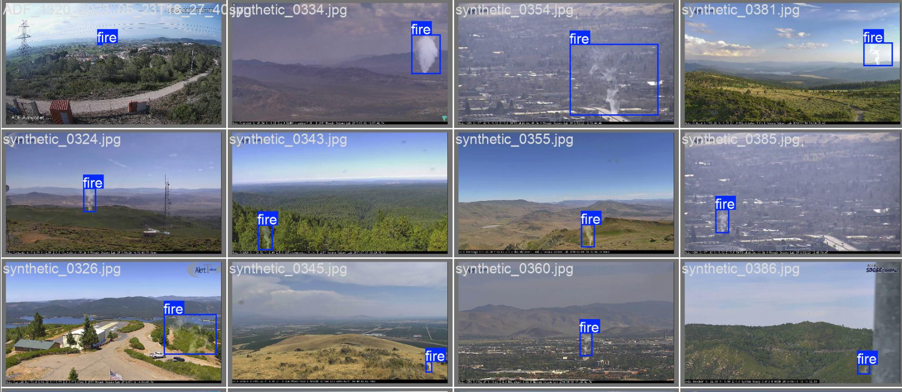

# Fire Detection Project 🔥

## Objective 🎯
The aim of this project is to develop in only one week a model capable of detecting fire-related objects in images captured by surveillance towers located in forests. This solution is designed to assist French firefighters in enhancing forest protection and improving early fire detection efforts.

---

## Results 📊
We trained and tested two versions of YOLO models for object detection and report the following results:

| **Metrics**          | **YOLOv8**           | **YOLOv5**           |
|-----------------------|----------------------|----------------------|
| **Precision (B)**     | 0.7364              | 0.7141              |
| **Recall (B)**        | 0.5721              | 0.5822              |
| **mAP50 (B)**         | 0.6462              | 0.6513              |
| **mAP50-95 (B)**      | 0.4001              | 0.3978              |
| **Fitness**           | 0.4247              | 0.4231              |

### Output Result

### Analysis
The comparison between YOLOv5 and YOLOv8 reveals slight improvements in precision and overall performance for YOLOv8:

- **Precision**: YOLOv8 achieves higher precision (0.736) compared to YOLOv5 (0.714), indicating better classification accuracy for detected objects.
- **Recall**: YOLOv5 has a slightly higher recall (0.582) compared to YOLOv8 (0.572), meaning YOLOv5 detects slightly more actual fire-related objects but may include more false positives.
- **mAP50 and mAP50-95**: These metrics, which measure detection accuracy at different thresholds, are very similar between the two models, with YOLOv8 slightly ahead for mAP50-95.
- **Fitness**: YOLOv8 marginally outperforms YOLOv5 in terms of fitness, demonstrating a better balance between precision and recall.

### Conclusion
Overall, YOLOv8 performs slightly better than YOLOv5 for this fire detection task. Its higher precision and improved fitness make it the preferred model for this application.

---

   

